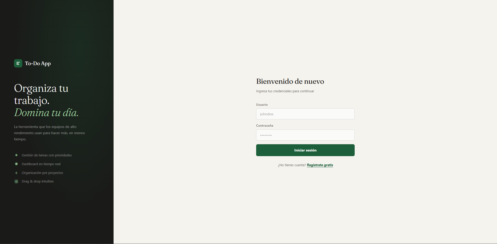

# To-Do App

> Live site: **[to-do-app-seven-wine-10.vercel.app](https://to-do-app-seven-wine-10.vercel.app)**

A full-stack task management app with a FastAPI backend and a vanilla JavaScript frontend. Features user authentication with JWT, per-user data isolation, and a clean REST API with auto-generated documentation.

---

## Preview



---

## Features

- Full CRUD for tasks (create, read, update, delete)
- User registration and login with JWT authentication
- Per-user data isolation — users only see their own tasks
- Password hashing with bcrypt
- Data validation with Pydantic v2
- SQLite database via SQLAlchemy ORM
- Interactive API docs at `/docs` (Swagger UI, auto-generated by FastAPI)

---

## Tech stack

| Layer      | Technology                        |
|------------|-----------------------------------|
| Backend    | Python · FastAPI · SQLAlchemy     |
| Auth       | JWT (python-jose) · bcrypt        |
| Validation | Pydantic v2                       |
| Database   | SQLite (dev) · PostgreSQL (prod)  |
| Server     | Uvicorn (ASGI)                    |
| Frontend   | JavaScript · CSS · HTML           |
| Deployment | Vercel (frontend) · Railway (API) |

---

## Getting started

### Prerequisites

- Python 3.11+
- Node.js (optional, for frontend live server)

### Backend

```bash
# 1. Clone the repo
git clone https://github.com/DevMathw/to-do-app.git
cd to-do-app

# 2. Create and activate a virtual environment
python -m venv venv
source venv/bin/activate      # Linux / macOS
# venv\Scripts\activate       # Windows

# 3. Install dependencies
pip install -r requirements.txt

# 4. Set up environment variables
cp .env.example .env
# Edit .env and add your SECRET_KEY

# 5. Run the development server
uvicorn app.main:app --reload
```

API available at: `http://localhost:8000`  
Interactive docs: `http://localhost:8000/docs`

### Frontend

```bash
cd front
# Open index.html directly in your browser
# or use the Live Server extension in VS Code
```

Make sure the backend is running before opening the frontend.

---

## Environment variables

Create a `.env` file in the root with the following:

```env
SECRET_KEY=your_secret_key_here
ACCESS_TOKEN_EXPIRE_MINUTES=30
```

Generate a secure key with:
```bash
python -c "import secrets; print(secrets.token_hex(32))"
```

---

## Project structure

```
to-do-app/
├── app/
│   ├── main.py              # App entry point and configuration
│   ├── database/
│   │   └── session.py       # SQLAlchemy engine and session
│   ├── models/
│   │   ├── user.py          # User ORM model
│   │   └── task.py          # Task ORM model
│   ├── schemas/
│   │   ├── user.py          # Pydantic schemas for users and tokens
│   │   └── task.py          # Pydantic schemas for tasks
│   ├── routes/
│   │   ├── auth.py          # POST /register, POST /login
│   │   └── tasks.py         # CRUD routes for tasks
│   └── core/
│       └── security.py      # JWT logic, bcrypt, get_current_user dependency
├── front/
│   ├── index.html           # App entry point
│   ├── app.js               # Frontend logic and API calls
│   └── style.css            # Styles
├── requirements.txt
└── .python-version
```

---

## API reference

### Auth

| Method | Endpoint              | Description              | Auth required |
|--------|-----------------------|--------------------------|---------------|
| POST   | `/api/auth/register`  | Register a new user      | No            |
| POST   | `/api/auth/login`     | Login and get JWT token  | No            |

### Tasks

| Method | Endpoint              | Description              | Auth required |
|--------|-----------------------|--------------------------|---------------|
| GET    | `/api/tasks/`         | Get all tasks for user   | Yes           |
| POST   | `/api/tasks/`         | Create a new task        | Yes           |
| GET    | `/api/tasks/{id}`     | Get a single task        | Yes           |
| PUT    | `/api/tasks/{id}`     | Update a task            | Yes           |
| DELETE | `/api/tasks/{id}`     | Delete a task            | Yes           |

### Example requests

**Register**
```bash
curl -X POST http://localhost:8000/api/auth/register \
  -H "Content-Type: application/json" \
  -d '{"username": "johndoe", "email": "john@example.com", "password": "secret123"}'
```

**Login**
```bash
curl -X POST http://localhost:8000/api/auth/login \
  -H "Content-Type: application/x-www-form-urlencoded" \
  -d "username=johndoe&password=secret123"
```

**Create a task** (requires Bearer token from login)
```bash
curl -X POST http://localhost:8000/api/tasks/ \
  -H "Authorization: Bearer <TOKEN>" \
  -H "Content-Type: application/json" \
  -d '{"title": "Buy groceries", "description": "Before 6pm"}'
```

**Mark task as completed**
```bash
curl -X PUT http://localhost:8000/api/tasks/1 \
  -H "Authorization: Bearer <TOKEN>" \
  -H "Content-Type: application/json" \
  -d '{"completed": true}'
```

---

## Deployment

### Backend — Railway (recommended)

1. Create an account at [railway.app](https://railway.app)
2. Connect your GitHub repo
3. Add environment variables: `SECRET_KEY`, `ACCESS_TOKEN_EXPIRE_MINUTES`
4. Set start command: `uvicorn app.main:app --host 0.0.0.0 --port $PORT`

### Frontend — Vercel

1. Import the repo on [vercel.com](https://vercel.com)
2. Set the root directory to `front`
3. Update the API base URL in `app.js` to point to your Railway backend

### Production checklist

- Move `SECRET_KEY` to an environment variable (never hardcode it)
- Switch from SQLite to PostgreSQL for persistence
- Configure CORS to accept only your frontend domain

---

## What I'd improve with more time

- Add task priorities and due dates
- Pagination for large task lists
- Unit tests for API routes with pytest
- Refresh token flow for better session management
- Migrate frontend to React with proper state management

---

## Contact

**Mateo Garcia** — Full-stack Developer  
[mathw.dev](https://mathw.dev) · [LinkedIn](https://www.linkedin.com/in/mateo-garcia-rodriguez-933135207/)