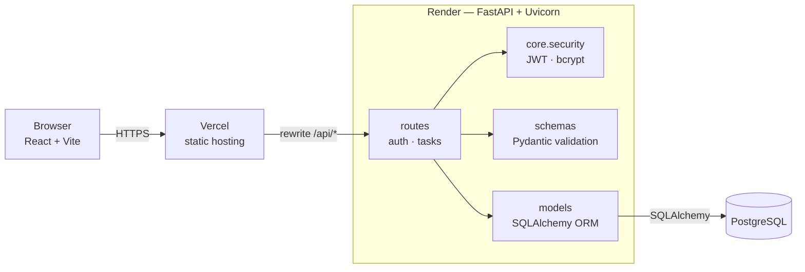
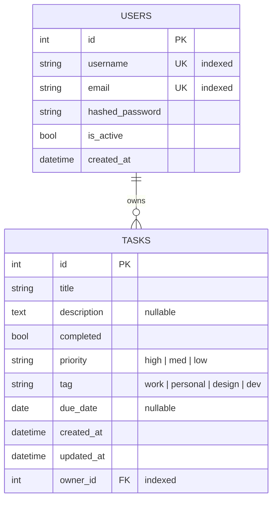

# To-Do App

[](https://github.com/DevMathw/to-do-app/actions/workflows/ci.yml)
[](LICENSE)
[](https://www.python.org/downloads/release/python-3119/)

A full-stack task manager built with **FastAPI** and **React**. Users sign up,
manage their own tasks with priorities, tags and due dates, and never see anyone
else's data — an isolation rule that is enforced in the API and covered by tests.

> **Live demo:** [to-do-app-seven-wine-10.vercel.app](https://to-do-app-seven-wine-10.vercel.app)
> There is a **"Probar la demo sin registrarme"** button that creates a throwaway
> account pre-loaded with sample tasks, so you can try it without signing up.
>
> The API runs on a free Render instance that sleeps after inactivity. The first
> request can take up to a minute to wake it up; the UI tells you when that is
> happening instead of hanging silently.

> **Note:** the user interface is in Spanish. This document is in English.

---

## Features

- Registration and login with JWT; the stored token is validated against the
  server on every page load, and an expired session logs you out with an
  explanation instead of showing an empty list.
- Full CRUD for tasks, with **priority**, **tag** and **due date** persisted in
  the database.
- Server-side filtering by state, priority and tag, plus text search across
  title and description.
- Paginated list responses (`items` + `total`), stable ordering.
- Overdue detection and progress stats computed from real data.
- Per-user data isolation enforced in every route.
- Responsive layout, keyboard navigation, ARIA roles and reduced-motion support.
- Auto-generated interactive API docs at `/docs`.

---

## Tech stack

| Layer         | Technology                                        |
| ------------- | ------------------------------------------------- |
| Backend       | Python 3.11 · FastAPI · SQLAlchemy 2.0            |
| Migrations    | Alembic                                           |
| Auth          | JWT (PyJWT) · bcrypt                              |
| Validation    | Pydantic v2 · pydantic-settings                   |
| Database      | SQLite (dev) · PostgreSQL (prod / Docker)         |
| Frontend      | React 18 · Vite · React Router · Zustand          |
| Styling       | CSS Modules                                       |
| Testing       | pytest · httpx · Vitest                           |
| Tooling       | Ruff · Docker · GitHub Actions                    |
| Deployment    | Vercel (frontend) · Render (API)                  |

---

## Architecture


```mermaid
flowchart LR
    B["Browser<br/>React + Vite"]
    V["Vercel<br/>static hosting"]

    subgraph R["Render — FastAPI + Uvicorn"]
        direction TB
        RT["routes<br/>auth · tasks"]
        SE["core.security<br/>JWT · bcrypt"]
        SC["schemas<br/>Pydantic validation"]
        MO["models<br/>SQLAlchemy ORM"]
        RT --> SE
        RT --> SC
        RT --> MO
    end

    D[("PostgreSQL")]

    B -->|HTTPS| V
    V -->|"rewrite /api/*"| RT
    MO -->|SQLAlchemy| D
```

The `/api` rewrite on Vercel means the browser only ever talks to one origin,
which keeps the CORS surface small and avoids a preflight on every request.

### Data model


```mermaid
erDiagram
    USERS ||--o{ TASKS : owns

    USERS {
        int      id PK
        string   username UK "indexed"
        string   email UK "indexed"
        string   hashed_password
        bool     is_active
        datetime created_at
    }

    TASKS {
        int      id PK
        string   title
        text     description "nullable"
        bool     completed
        string   priority "high | med | low"
        string   tag "work | personal | design | dev"
        date     due_date "nullable"
        datetime created_at
        datetime updated_at
        int      owner_id FK "indexed"
    }
```

---

## Running it locally

### With Docker (recommended)

Brings up the API and PostgreSQL, and applies migrations automatically:

```bash
git clone https://github.com/DevMathw/to-do-app.git
cd to-do-app
docker compose up --build
```

API at `http://localhost:8000` · docs at `http://localhost:8000/docs`.

Then start the frontend:

```bash
cd front
npm install
npm run dev
```

App at `http://localhost:5173`.

### Without Docker

```bash
# 1. Virtual environment
python -m venv venv
source venv/bin/activate       # Linux / macOS
# venv\Scripts\activate        # Windows

# 2. Dependencies
pip install -r requirements-dev.txt

# 3. Environment variables
cp .env.example .env
python -c "import secrets; print(secrets.token_hex(32))"   # paste into SECRET_KEY

# 4. Database schema
alembic upgrade head

# 5. Run
uvicorn app.main:app --reload
```

The app **will not start** without a `SECRET_KEY`. That is deliberate — see
[ADR 0002](docs/decisions/0002-fail-fast-configuration.md).

---

## Environment variables

| Variable                      | Required | Default                 | Description                                     |
| ----------------------------- | -------- | ----------------------- | ----------------------------------------------- |
| `SECRET_KEY`                  | **yes**  | —                       | JWT signing key, min. 32 chars. No fallback.    |
| `DATABASE_URL`                | no       | `sqlite:///./todo.db`   | SQLAlchemy connection URL.                      |
| `CORS_ORIGINS`                | no       | `http://localhost:5173` | Comma-separated allow-list. Never `*`.          |
| `ACCESS_TOKEN_EXPIRE_MINUTES` | no       | `60`                    | Access-token lifetime.                          |
| `BCRYPT_ROUNDS`               | no       | `12`                    | bcrypt cost. Tests use `4` to stay fast.        |
| `ENVIRONMENT`                 | no       | `development`           | Reported by `/health`.                          |

See [`.env.example`](.env.example).

---

## Testing

```bash
pytest                                    # 36 backend tests
pytest --cov=app --cov-report=term-missing
cd front && npm test                      # 12 frontend tests
```

Backend coverage is currently **94%**. Each test gets its own in-memory SQLite
database, so tests are order-independent.

The suite that matters most is
[`tests/test_authorization.py`](tests/test_authorization.py): it proves that a
logged-in user cannot read, modify or delete another user's tasks through any
route, and that `owner_id` cannot be forged from the client.

---

## API reference

Base path: `/api/v1`. Interactive docs at `/docs`.

### Auth

| Method | Endpoint         | Description                     | Auth |
| ------ | ---------------- | ------------------------------- | ---- |
| POST   | `/auth/register` | Create an account               | No   |
| POST   | `/auth/login`    | Exchange credentials for a JWT  | No   |
| GET    | `/auth/me`       | Current user (validates token)  | Yes  |

### Tasks

| Method | Endpoint      | Description                      | Auth |
| ------ | ------------- | -------------------------------- | ---- |
| GET    | `/tasks`      | List, filter, search, paginate   | Yes  |
| POST   | `/tasks`      | Create a task                    | Yes  |
| GET    | `/tasks/{id}` | Get one task                     | Yes  |
| PATCH  | `/tasks/{id}` | Partial update                   | Yes  |
| DELETE | `/tasks/{id}` | Delete a task                    | Yes  |

`GET /tasks` accepts `completed`, `priority`, `tag`, `search`, `skip` and
`limit`, and returns `{ "items": [...], "total": n, "skip": n, "limit": n }`.

### Status

| Method | Endpoint  | Description                              |
| ------ | --------- | ---------------------------------------- |
| GET    | `/`       | API metadata                             |
| GET    | `/health` | Liveness **and** a real database check    |

### Examples

```bash
# Register
curl -X POST http://localhost:8000/api/v1/auth/register \
  -H "Content-Type: application/json" \
  -d '{"username":"johndoe","email":"john@example.com","password":"a-good-password"}'

# Login
curl -X POST http://localhost:8000/api/v1/auth/login \
  -H "Content-Type: application/x-www-form-urlencoded" \
  -d "username=johndoe&password=a-good-password"

# Create a task
curl -X POST http://localhost:8000/api/v1/tasks \
  -H "Authorization: Bearer <TOKEN>" \
  -H "Content-Type: application/json" \
  -d '{"title":"Buy groceries","priority":"high","tag":"personal","due_date":"2026-09-15"}'

# High-priority pending tasks
curl "http://localhost:8000/api/v1/tasks?priority=high&completed=false" \
  -H "Authorization: Bearer <TOKEN>"
```

---

## Deployment

The frontend is a static build on Vercel; the API runs on Render.

### Frontend (Vercel)

Root directory: `front`. [`front/vercel.json`](front/vercel.json) rewrites
`/api/*` to the Render service, so the browser only ever talks to the Vercel
origin.

**Do not set `VITE_API_URL`.** Leaving it unset makes the client use the
relative path `/api/v1` and go through that rewrite: same origin, no CORS, no
preflight round trip on an already slow free-tier backend. Setting it to the
Render URL makes every request cross-origin and requires `CORS_ORIGINS` to be
kept in sync with the deployment domain.

### API (Render)

[`render.yaml`](render.yaml) describes the service. A service created by hand in
the dashboard does not read that file, so these two settings have to match it:

| Setting       | Value                                                                    |
| ------------- | ------------------------------------------------------------------------ |
| Build command | `pip install -r requirements.txt`                                        |
| Start command | `alembic upgrade head && uvicorn app.main:app --host 0.0.0.0 --port $PORT` |

The `alembic upgrade head` is not optional. The application does not create its
own schema (see [ADR 0003](docs/decisions/0003-alembic-migrations.md)), so
without it the tables never exist and every request that touches the database
returns 500.

Required environment variables: `SECRET_KEY` (32+ chars) and `DATABASE_URL`
pointing at PostgreSQL. Render's free web instances do not persist their
filesystem, so leaving `DATABASE_URL` on the SQLite default means losing every
account and task on each restart.

---

## Technical decisions

Short write-ups of the choices that were not obvious, and what they cost:

- [0001 — 404 instead of 403 for tasks you don't own](docs/decisions/0001-404-instead-of-403.md)
- [0002 — Configuration fails fast, with no default secret](docs/decisions/0002-fail-fast-configuration.md)
- [0003 — Alembic from the start, not `create_all`](docs/decisions/0003-alembic-migrations.md)
- [0004 — PATCH instead of PUT for partial updates](docs/decisions/0004-patch-not-put.md)
- [0005 — No WebSockets, no roles, no microservices](docs/decisions/0005-what-we-did-not-build.md)

---

## Project structure

```
to-do-app/
├── app/
│   ├── main.py                 # App, middleware, error handlers, /health
│   ├── core/
│   │   ├── config.py           # Settings from environment (fail-fast)
│   │   └── security.py         # JWT, bcrypt, get_current_user
│   ├── database/session.py     # Engine and session factory
│   ├── models/                 # SQLAlchemy ORM models
│   ├── schemas/                # Pydantic request/response schemas
│   └── routes/                 # auth.py, tasks.py
├── alembic/versions/           # Versioned migrations
├── tests/                      # pytest suite
├── front/
│   └── src/
│       ├── api/                # HTTP client, demo seeding
│       ├── components/         # TaskCard, QuickAdd, Sidebar, TopBar…
│       ├── context/            # AuthContext
│       ├── lib/                # Filtering and date logic (unit-tested)
│       ├── pages/              # AuthPage, DashboardPage, NotFoundPage
│       └── store/              # Zustand store
├── docs/decisions/             # ADRs
├── .github/workflows/ci.yml    # Lint, tests, build, Docker image
├── Dockerfile
└── docker-compose.yml
```

---

## Roadmap

Known gaps, in the order I would tackle them:

- Refresh tokens in `httpOnly` cookies, replacing the access token in
  `localStorage`.
- Rate limiting on `/auth/login` and `/auth/register`.
- A `completed_at` column, so progress can be reported per week instead of
  overall.
- Subtasks and real projects.
- End-to-end tests with Playwright.

---

## License

[MIT](LICENSE)

---

## Contact

**Mateo Garcia** — Full-stack Developer
[mathw.dev](https://mathw.dev) · [LinkedIn](https://www.linkedin.com/in/mateo-garcia-rodriguez-933135207/)
